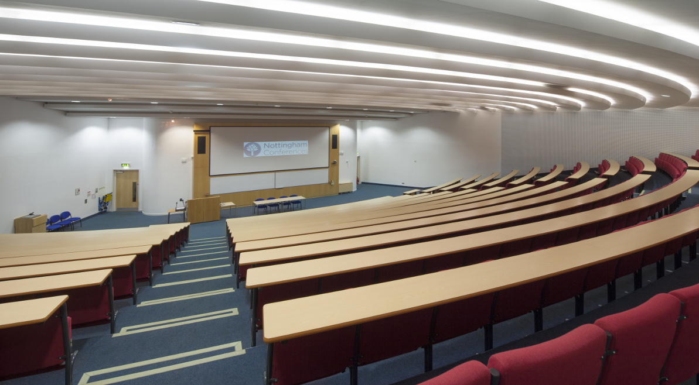

# Maximising Lecture Theatre Capacity

The React JS application is an attendance booking system. This manages events to optimise attendance for a lecture or a lab hosted by a lecturer. Attendance for students is tracked to help prioritise booking for active students who want to attend in person.

  

## Documentation Links
* [Trello Board](https://trello.com/b/02OXcLtP/maximising-lecture-theatre-capacity)
* [Documentation Repositry](https://uniofnottm-my.sharepoint.com/:f:/g/personal/psygm2_nottingham_ac_uk/EjlSay6gD0ZBq-E3v1oxnP4Bh5YH5R0ZSI5nZxbjHbu7tA)

## Behind the priority score (rough notes for now)

**Details**

- Range is 0-1
- Every student starts with a perfect score of 1
- Score is based on the last 90 days
- 3 States = booked and attended on time (BAT), booked and attended late (BAL), booked and not attended (BNA) 
- If a student never books then their score remains as 1 as technically they’ve never BAL/BNA, so we cannot assume that they are an unpunctual student
- BNA is x3 the penalty of BAL penalty 

**Calculations involved**

To calculate a student’s score, we make three calculations:
- Main Score = total events attended / total events booked
- Late Score = (total events attended late / total events booked) / 3
- Total score = Main Score + Late Score 

For instance: 

10 Booked 10 Attended 0 Late = 1  
10 Booked 8 Attended 2 Late = 0.74  
10 Booked 10 Attended 10 Late = 0.67  
10 Booked 7 Attended 0 Late = 0.7  
10 Booked 2 Attended 0 Late  = 0.2  
10 Booked 2 Attended 1 Late = 0.16  
10 Booked 0 Attended 0 Late = 0 

**Personas**

_Bad student_  

Main Score = Number attended / Number Booked e.g., 2 / 10 = 0.2 

Late Score = (Number Late / Number Booked) / 3 e.g., 3 / 10 = (0.3 / 3) = 0.1 

Total score = Main Score + Late Score = 0.3  

  

_Good student_

Main Score = Number attended / Number Booked e.g., 7 / 10 = 0.7   

Late Score = (Number Late / Number Booked) / 3 e.g., 2 / 10 = (0.2/ 3) = 0.066

Total score = Main Score + Late Score = 0.766

